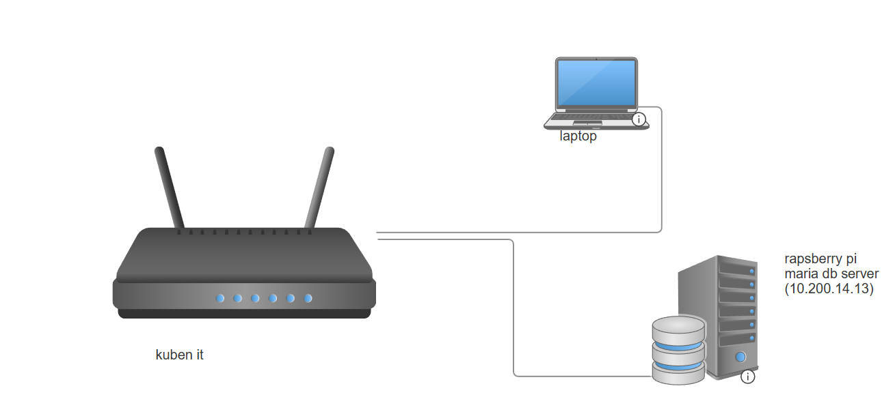

# private_user_library

## 1. pages

**evil LM:**\
**Sebastian Branden:**\
**2IMI:**\
**10/11/25:**
**description:**\
*this is a hub for evil LM where you can see future plans, members and already executed missions*

### a. frontpage
*this is the frontpage of the site*

### b. members page
*this shows all members in evil_LM*\
*this also include add new member page and an alter page*

### c. accomplisments
*this show what evil_LM has completed*

### d. events page

*shows uppcomming events*
------------------------------------------------------------------------


## 2. Systembeskrivelse

**hub for memebers of evil LM**\
*the website shares what evil LM does and makes it easy for members to see future plans*

**uses:**\
*from any page you have acces to to go to a front page with info, memebers page containing all memebers, a accomplisments page where you see stuff that has already been completed and the companys future goals*

**Teknologier brukt:**

-   Python / Flask\
-   MariaDB\
-   HTML / CSS / JS\

------------------------------------------------------------------------

## 3. Server-, infrastruktur- og nettverksoppsett

### Servermiljø

*uses a flask python enviorment with flask, dotenv and mysql_connector installed*

*.env file keeps password and other imortant info safe*
### Nettverksoppsett

-   nettwork: 



-   IP-adresser:
```
        rapsberry pi database sever: 10.200.14.13
        laptop website host: any 
```

-   Porter\
```
        rapsberry pi database sever: 3306 (mariadb)
        laptop website host: 5000
```

-   firewall: *currently the website isnt deployed so no firewall changes have had to be made*

------------------------------------------------------------------------

## 4. Prosjektstyring -- GitHub Projects (Kanban)

https://github.com/users/sebrai/projects/3/views/1

i use kanban to organize work

------------------------------------------------------------------------

## 5. Databasebeskrivelse

**Database name: evil_lm**

**Tables:**

**members:**

``` sql
        +------------+--------------+------+-----+-----------+----------------+
        | Field      | Type         | Null | Key | Default   | Extra          |
        +------------+--------------+------+-----+-----------+----------------+
        | id         | int(11)      | NO   | PRI | NULL      | auto_increment |
        | name       | varchar(50)  | NO   |     | NULL      |                |
        | email      | varchar(100) | NO   | UNI | NULL      |                |
        | date_start | date         | YES  |     | curdate() |                |
        | role       | varchar(50)  | NO   |     | 'grunt'   |                |
        +------------+--------------+------+-----+-----------+----------------+
```

**done(old jobs):**

``` sql
        +----------+--------------+------+-----+-----------------+----------------+
        | Field    | Type         | Null | Key | Default         | Extra          |
        +----------+--------------+------+-----+-----------------+----------------+
        | id       | int(11)      | NO   | PRI | NULL            | auto_increment |
        | title    | varchar(100) | NO   | UNI | NULL            |                |
        | descr    | tinytext     | YES  |     | 'no decription' |                |
        | date     | date         | YES  |     | curdate()       |                |
        | event_id | int(11)      | YES  | MUL | NULL            |                |
        +----------+--------------+------+-----+-----------------+----------------+
```
**events(upcomming):**

``` sql
        +----------------+--------------+------+-----+---------+----------------+
        | Field          | Type         | Null | Key | Default | Extra          |
        +----------------+--------------+------+-----+---------+----------------+
        | id             | int(11)      | NO   | PRI | NULL    | auto_increment |
        | title          | varchar(63)  | YES  |     |         |                |
        | descr          | varchar(255) | YES  |     | NULL    |                |
        | scale          | varchar(255) | YES  |     | NULL    |                |
        | members_needed | int(11)      | YES  |     | NULL    |                |
        | done           | tinyint(1)   | YES  |     | 0       |                |
        | cur_members    | int(11)      | YES  |     | 0       |                |
        +----------------+--------------+------+-----+---------+----------------+


```
**SQL-eksempel:**

**insert example**

``` sql
    INSERT INTO members(name,email) VALUES('yourname','your@email.com');
```

**events table creation**

``` sql
        CREATE TABLE events  ( id INT AUTO_INCREMENT PRIMARY KEY,
                title VARCHAR(63) DEFAULT '', 
                descr VARCHAR(255), 
                scale VARCHAR(255), 
                members_needed INT, 
                done BOOLEAN DEFAULT 0);
```
------------------------------------------------------------------------

## 6. file structure

    evil_LM/
     ├── app.py
     ├── templates/
                ├── index.html  
                ├── members.html  
                ├── upcomming.html  
                ├── done.html  
                ├── addmem.html  
                ├── newevent.html  
                ├── altermem.html       
     ├── static/
                ├── css/
                        ├── main.css
                ├── js/
                        ├── done.js
                        ├── events.js
                        ├── members.js
                        ├── processes.js
                ├── favicon.png
     ├── .venv
     ├── .gitignore
     └── .env
Databasestrøm:

    HTML(request) → Flask → MariaDB → Flask → HTML-tabell

------------------------------------------------------------------------

## 7. Kode eksplanation

### @app.route 

*route asks the function below for what to return when a spesific file path is in the browser*
*for example: route "/" calls the function main for what to show and main return with a template of index.html*

``` python
       @app.route('/')
        def main():
        return render_template("index.html")
```

### mydb and my_cursor

*these allow you to querry the backend database for data, it can also insert data.*
*for example: route "/events/show_all" uses mycursor.execute to send in a querry to the databsae asking it to show all rows in events table.*
*it then uses mycursur.fetchall to turn the data into a python tuple.*

``` python
        @app.route('/events/show_all')
        def show_all():
        mydb = mysql.connector.connect(# variables are taken from a .env file
        host = host,
        port = int(port),
        user = userdb,
        password = password, 
        database = dbname,
        use_pure = True
        )
        mycursor = mydb.cursor()
        mycursor.execute("SELECT * FROM events")
        result = mycursor.fetchall()
        return render_template('upcomming.html', data = result) 
```

### processes.js

*this file converts the text inside a elemnt with id "data" into a usable js array with the name data.*
*it does this if the text is formated ass a python tuple like the data from fetchall is.*

``` js
        console.log("hello")
        let raw = document.getElementById("data").textContent
        function py_to_json(str = raw) {
        
        result = str.replaceAll("(", "[").replaceAll(")", "]").replaceAll("'", '"');
        console.table(JSON.parse(result))
        return result
        }
        let data = JSON.parse(py_to_json(raw))
        console.table(data)
```


------------------------------------------------------------------------

## 8. security


-   Miljøvariabler: *password, host, port, user and db*\
-   Parameteriserte spørringer: 
``` python
         mycursor = mydb.cursor() #alter mebers page
        mycursor.execute("UPDATE members SET name = %s , email = %s WHERE id = %s",(name,email,id))
        mydb.commit()
        mycursor.execute("SELECT * FROM members")
        result = mycursor.fetchall()
        fresult = []
        for items in result:
            thing = (items[0],items[1],items[2],items[3].isoformat()) #to make sure datetime is conveted properly
            fresult.append(thing)
        return render_template('members.html',data = fresult)
```

------------------------------------------------------------------------

## 9. errors along the way

-   error example:

```
mysql.connector.errors.DataError
mysql.connector.errors.DataError: 1366 (22007): Incorrect integer value: '' for column `evil_lm`.`events`.`members_needed` at row 1
```
*it apeares because the members needed column on the table is meant to be an int,*
*but what i am trying to putt in is " "*

- error fix

*i fixed this by adding in the second line*
``` python
        needed = request.form['needed']
        needed = int(needed) if needed else 1 #turns needed into an integer if possible otherwise it becomes 1
```

------------------------------------------------------------------------

## 10. konklution and reflektion

-   i learned a lot about programing with flask 

-   Hva fungerte bra?

-   Hva ville du gjort annerledes?

-   Hva var utfordrende?

------------------------------------------------------------------------

## 11. sources

-   w3schools.com/js/default.asp
-   http://w3schools.com/mysql/default.asp
-   w3schools.com/python/default.asp
-   flask.palletsprojects.com
