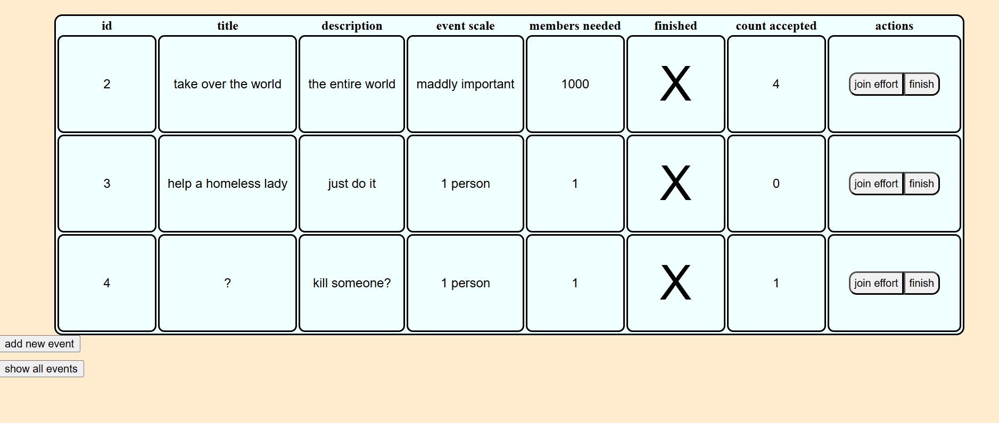
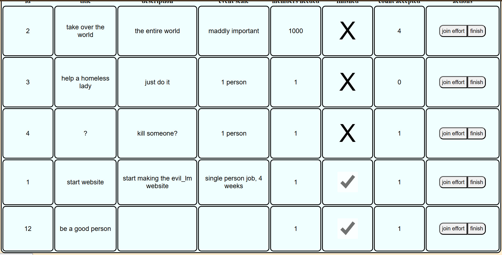
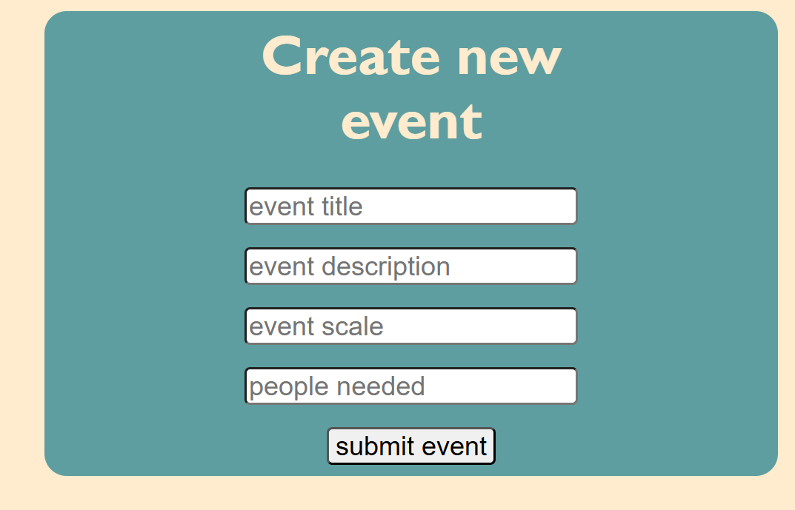
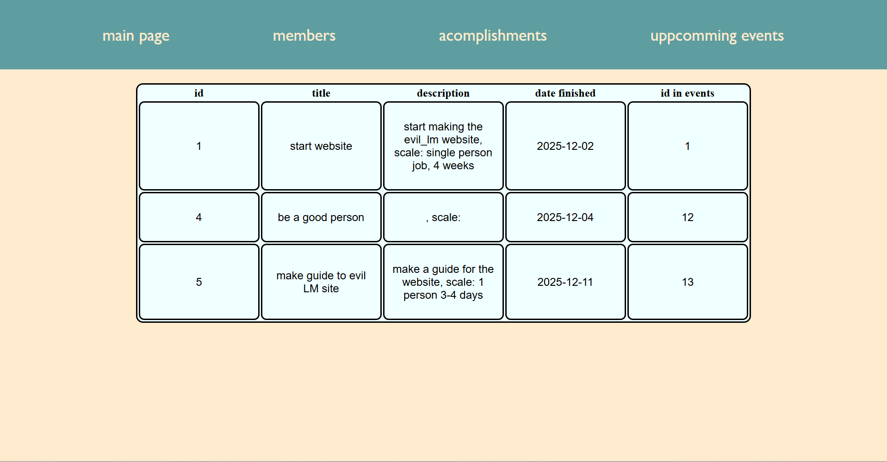

# guide to the evil LM website

## main page:
*from the main page you have acces to* **members, accomplisments and events**

- *simply click on the tekst in the navbar to acces the page*
- *here you can also find info about the company currently this is blanc*

---

## members page:
*here you have acces to look at the members table here you can add a member(red)*
*or you can edit or delte individual members row(blue)*

*here you can see id,name,email and the date they joined*

### add member:

*here you enter you name and email to add a new entry into members*

### change member:
*pressing change opens this page:*

*here you can change details about a member,*
*for example alter the name if it was mispelled*

---

## events page
*here you can:* **add a new event, show all events** *(includes completed)* **, join the event, and mark it as finished**

### join effort:

*this button adds one to:* **"count accepted"**

### finish:

*sets the rows finished to true, this changes the* **" X "** *to a* **" ✓ "**

### show all events:

*now you can see all finished events to*

### new event

*if you press* **"add new event"** *you are taken to* **this** *page^*
*here you need to insert:*
- *event tilte*
- *a description of the event*
- *the scale of the event, for eksample how many people are needed or how long the task takes*
- *and lastly you need to insert a number of how many people are required for the event*

---

## accomplishments

*when on the accomplishments page you can see:*
- *the title of the finished* **event**
- *a larger description including both the* **event** *description and the event scale*
- *date finished*
- *its relevant id in the* **events** *page*

